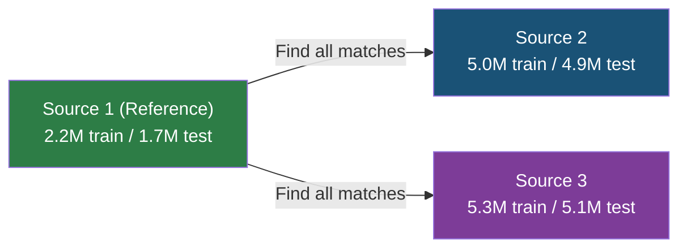
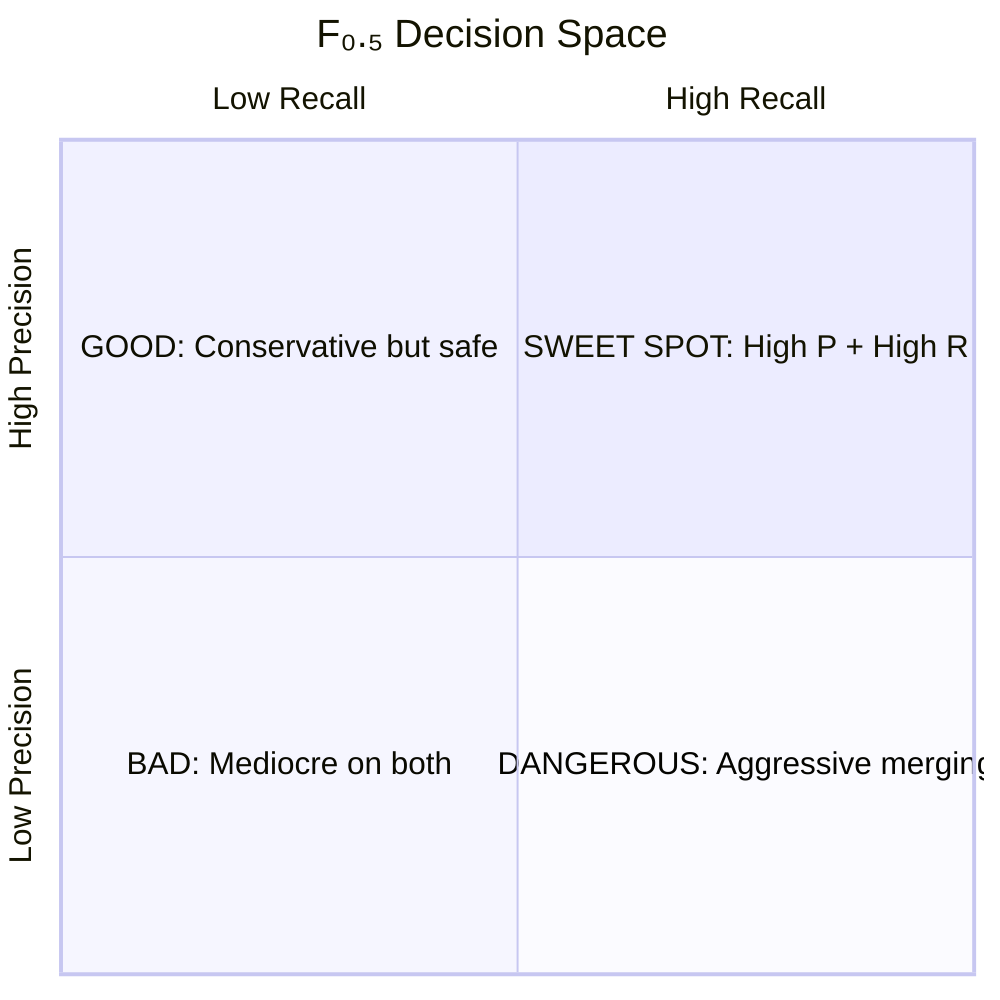
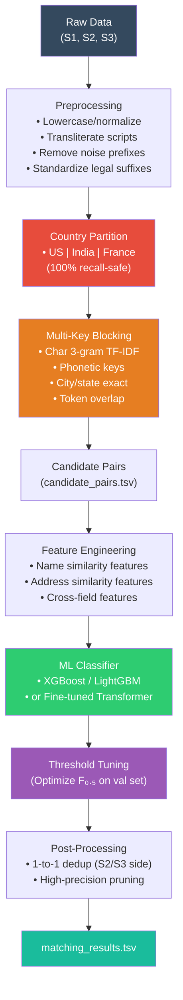

> **Version:** v1.0 | **Last updated:** 2026-09-26 02:07 IST | **By:** Codex

# Amazon ML Challenge 2026 — Comprehensive Problem Analysis

## 1. Domain: Business Entity Resolution

**Entity Resolution (ER)** — also called record linkage, deduplication, or data matching — is the task of identifying records across different databases that refer to the **same real-world entity** despite having no shared unique identifiers. It's a cornerstone problem in:

- **E-commerce platforms** (Amazon's core use case): merging seller/supplier records from multiple onboarding channels
- **Financial compliance** (KYC/AML): linking business identities across registries
- **Government records**: census deduplication, tax authority matching
- **Healthcare**: patient record unification across hospitals

> [!IMPORTANT]
> This is **not** a simple string-matching problem. It combines NLP, information retrieval, supervised classification, and scalable systems engineering into a single challenge. The data exhibits **extreme noise**: typos, transliterations across 8+ scripts, synthetic aliases, missing fields, and address reformatting.

---

## 2. Task Definition

### What You Must Do

Given **business records from 3 independent data sources**, determine which records across sources refer to the **same real-world business entity**.

**Key structural rules:**
- **Source 1 is the anchor/reference** — it's deduplicated. You match S2/S3 records *to* S1 entities.
- Each S1 entity may match **zero** (singleton), **one**, or **many** records from S2 and S3.
- Each S2/S3 record maps to **at most one** S1 entity (confirmed from ground truth analysis — 1-to-1 mapping from S2/S3 → S1).
- ~25% of S2 and ~28% of S3 records are **distractors** that don't match any S1 entity.

### Data Schema

Each source file has **4 columns** (tab-separated):

| Column | Description | Completeness |
|:---|:---|:---|
| `entity_id` | Unique ID with prefix `S1-`, `S2-`, or `S3-` | 100% |
| `business_name` | Business name (noisy) | ~100% (2-59 nulls in S2/S3) |
| `business_address` | Address (noisy) | S1: 100%, S2/S3: ~97% (3.3% missing) |
| `country` | Country label | 100% |

---

## 3. Dataset Scale & Statistics

### 3.1 Record Counts

See [`context/problem-and-data.md`](../context/problem-and-data.md) for the canonical verified train and test counts.

> [!WARNING]
> **Brute-force is impossible.** The test set alone requires 1.7M × 10M = **17.3 trillion** pairwise comparisons without blocking. An efficient blocking/candidate generation strategy is **mandatory**.

### 3.2 Country Distribution

| Country | Train (all sources) | Test (all sources) | Key Note |
|:---|---:|---:|:---|
| **US** | 7,510,506 (59.95%) | 4,480,137 (38.28%) | Present in both train & test |
| **India** | 5,016,536 (40.05%) | 5,527,551 (47.24%) | Present in both train & test |
| **France** | 0 (0.00%) | 1,694,445 (14.48%) | ⚠️ **Zero-shot — test only!** |

> [!CAUTION]
> **France is a zero-shot domain shift.** 259,452 Source 1 test entities are French — that's ~15% of your final score with **no training data**. Any pipeline hardcoded to US/India patterns will catastrophically fail on this segment.

### 3.3 Ground Truth: Match Distribution

| Matches per S1 Entity | Count | Percentage | Cumulative % |
|:---|---:|---:|---:|
| 0 (singletons) | 123,247 | 5.6% | 5.6% |
| 1 | 119,157 | 5.4% | 11.0% |
| 2 | 375,212 | 17.0% | 28.0% |
| 3 | 530,841 | 24.1% | 52.0% |
| 4 | 484,115 | 21.9% | 74.0% |
| 5 | 321,957 | 14.6% | 88.5% |
| 6 | 164,868 | 7.5% | 96.0% |
| 7+ | 87,424 | 4.0% | 100.0% |

**Source-level linkage:**
- S1 entities with ≥1 S2 match: **86.96%** → total S2 links: 3,693,619
- S1 entities with ≥1 S3 match: **87.93%** → total S3 links: 3,944,746
- S1 entities with matches from **both** S2 and S3: **80.48%**

### 3.4 Null / Missing Field Analysis

| File | Null Names | Null Addresses | Null Addr % | Avg Name Len | Avg Addr Len |
|:---|---:|---:|---:|---:|---:|
| Train S1 | 0 | 0 | 0.00% | 24.0 | 52.1 |
| Train S2 | 2 | 168,967 | 3.36% | 25.1 | 46.2 |
| Train S3 | 13 | 175,916 | 3.33% | 25.2 | 46.7 |
| Test S1 | 0 | 0 | 0.00% | 23.8 | 57.2 |
| Test S2 | 46 | 129,408 | 2.65% | 25.7 | 50.4 |
| Test S3 | 59 | 136,098 | 2.68% | 25.7 | 48.7 |

---

## 4. Noise Patterns — The Core Challenge

### 4.1 Business Name Noise

| Noise Type | Example (S1 → S2/S3) | Difficulty |
|:---|:---|:---:|
| **Typos** | `Enterprises` → `Enterpires`, `Énterprises` | Medium |
| **Scrambled characters** | `Payne Enterprises` → `PAYNE-ENRTPRMISES` | Hard |
| **Legal suffix variation** | `Private Limited` → `Pvt Ltd` → `Pvt. Ltd.` → `P. L.` | Medium |
| **Cross-script transliteration** | `Ss Food Private Limited` → `एसएस फूड प्राइवेट लिमिटेड` | Very Hard |
| **Synthetic aliases/codes** | `Maure Williams Colombier Inc` → `Dréxkor` | Extreme |
| **Domain name format** | `Maure Williams Colombier Inc` → `maurewilliamscolombier.com` | Hard |
| **Word reduplication** | `Ferrero Duke` → `FERRERO FERRERO DUKE` | Medium |
| **Prefix/suffix injection** | `Holloway Peak Inc` → `-- Holloway Peak Inc Seafood` | Medium |
| **Bracket-enclosed suffixes** | `Inc` → `[INCORPORATED]`, `((Limited))` | Medium |
| **Accented/leetspeak** | `Learning` → `Léarning`, `Studios` → `5TUDIOS` | Hard |
| **8+ Indian scripts** | Devanagari, Tamil, Gujarati, Telugu, Bengali, Kannada, Punjabi, etc. | Very Hard |

### 4.2 Business Address Noise

| Noise Type | Example | Difficulty |
|:---|:---|:---:|
| **Abbreviations** | `Street` → `St`, `Avenue` → `Ave`, `Road` → `Rd` | Easy |
| **State format** | `Maharashtra` → `MH` → `महाराष्ट्र` (Devanagari) | Hard |
| **Component reordering** | `630 45th Terrace, Kansas City, MO` → `KANSAS CITY, MO, 630 45ND TERRACE` | Hard |
| **Severe truncation** | Full address → `2505, Mumbai, MH` | Very Hard |
| **Complete absence** | Full address → `<empty>` (~3.3% of S2/S3) | Critical |
| **Landmark references** | `Near Fortis Hospital`, `Opp. Rta Office` | Hard |
| **Number noise** | `45th` → `45ND`, `Af-684` → `AF-0684` | Medium |
| **Street type confusion** | `Street` → `Saint` (!) | Hard |
| **Placeholders** | `<NULL>`, `null`, `N/A` as address values | Medium |

---

## 5. Evaluation Metric: F₀.₅ (Precision-Heavy)

### 5.1 Formula

$$F_{0.5} = \frac{1.25 \times \text{Precision} \times \text{Recall}}{0.25 \times \text{Precision} + \text{Recall}}$$

- **Precision weight: 2×** over Recall
- Computed as **macro-average**: F₀.₅ per S1 entity, then averaged across **all** S1 entities

### 5.2 Critical Implications

| Scenario | Precision | Recall | F₀.₅ | Lesson |
|:---|---:|---:|---:|:---|
| Perfect | 1.0 | 1.0 | **1.000** | Ideal |
| High P, moderate R | 1.0 | 0.7 | **0.962** | ← Only 3.8% loss! |
| High R, moderate P | 0.7 | 1.0 | **0.714** | ← 28.6% loss! |
| Balanced 0.8 | 0.8 | 0.8 | **0.800** | Baseline |
| All empty predictions | — | 0.0 | **varies** | Singletons score 1.0 |

> [!IMPORTANT]
> **Lesson:** Missing a true match (FN) costs far less than incorrectly merging two different businesses (FP). **When in doubt, don't merge.**

### 5.3 Singleton Scoring Rules

- S1 entity with **no true matches** + you predict **empty list** → score **1.0** ✅
- S1 entity with **no true matches** + you predict **any match** → score **0.0** ❌
- Singletons are **5.6%** of training data → correctly handling them is free precision

---

## 6. Output Requirements

### Two output files (tab-separated):

| File | Purpose | Scored? |
|:---|:---|:---:|
| `matching_results.tsv` | Final entity matches | ✅ **Yes — leaderboard** |
| `candidate_pairs.tsv` | Blocking candidates (superset of matches) | ❌ No — audit only |

### Critical format rules:
- **Every** S1 test entity must have exactly one row; see [`context/problem-and-data.md`](../context/problem-and-data.md) for the canonical count and output contract.
- Empty `matched_entity_ids` for singletons (not "none" or "null" — literally empty)
- Only S2-/S3- IDs that exist in the test set
- No duplicate IDs within a list; no duplicate S1 rows
- **Tab-separated** (not comma-separated!)
- Must pass `utils/validate_submission.py`

### Constraints:
- Model ≤ **8 billion parameters**
- **MIT or Apache 2.0 license** only
- **No external data** (APIs, geocoding, business registries, etc.)

### Leaderboard:
- **Public**: scored on subset of test during competition
- **Private**: scored on remaining test after competition → **final ranking**
- Top teams' code packages are reviewed before rankings are confirmed

---

## 7. Independent Evaluation: Blind Spots & Subtleties

> [!CAUTION]
> The following are non-obvious insights that many participants will miss.

### 7.1 🎯 The France Trap (Zero-Shot Domain Transfer)

**The problem:** 15% of test S1 entities are French, with zero French training data.

**What most teams will miss:**
- Hardcoded US/India state abbreviation dictionaries will fail
- English-only NLP models won't handle French legal forms (`SARL`, `SAS`, `SASU`, `EURL`, `SCI`, `SA`)
- French address vocabulary (`Rue`, `Boulevard`, `Allée`, `Impasse`, `Lieu-dit`, `bis`, `ter`) differs entirely from English/Hindi
- French departments/regions (`Nouvelle-Aquitaine`, `Hauts-de-France`, `Gironde`, `Nord`) ≠ US states or Indian states

**Winning strategy:** Use **language-agnostic features** (character n-grams, Jaccard on token sets, edit distance) that transfer across languages. Use **multilingual embeddings** (e.g., `paraphrase-multilingual-MiniLM-L12-v2` or similar ≤8B model) that handle French without fine-tuning.

### 7.2 🔤 The Cross-Script Problem (India)

**The problem:** Indian business names appear in **8+ scripts**: Devanagari, Tamil, Gujarati, Telugu, Bengali, Kannada, Punjabi, and Latin.

**What most teams will miss:**
- Standard string similarity between `Ss Food Private Limited` and `एसएस फूड प्राइवेट लिमिटेड` is **0.0**
- This affects a **massive** fraction of Indian records — potentially 40%+ of Indian S2/S3 entries
- State names also appear in native scripts: `उत्तर प्रदेश` = `Uttar Pradesh` = `UP`

**Winning strategy:** Apply **transliteration** (e.g., `indic_transliteration`, `AI4Bharat IndicTrans`, or Unicode-to-Latin mapping) as a preprocessing step before any string comparison. Build parallel blocking keys in both Latin and native scripts.

### 7.3 🏗️ The Blocking Recall Ceiling

**The problem:** Your blocking strategy determines the **upper bound** of your recall. Any true pair not retrieved by blocking is permanently lost.

**What most teams will miss:**
- With ~3.3% null addresses in S2/S3, blocking on address alone will miss ~168K S2 and ~176K S3 records
- Synthetic aliases like `Dréxkor` share **zero tokens** with the reference name — pure name blocking misses these
- Domain-name formats (`maurewilliamscolombier.com`) won't match standard name tokenization

**Winning strategy:** Use **multiple orthogonal blocking keys** with union:
1. Character 3-gram Jaccard on normalized name
2. Phonetic encoding (Soundex/Metaphone) on name tokens
3. TF-IDF cosine on name + address combined
4. City/state exact match (where address exists)
5. Token-level intersection (min 2 tokens overlap)

### 7.4 📊 The Singleton Free Lunch

**The problem:** 5.6% of S1 entities are singletons (no matches). Under macro-averaged F₀.₅, each correctly-predicted singleton scores **1.0**, and each false-merged singleton scores **0.0**.

**What most teams will miss:**
- ~123K training singletons × 1.0 score each = massive free points
- If your blocking generates 0 candidates for an entity, **keep it empty** — don't force-merge
- The test set likely has a similar singleton proportion (~5-6%)
- Aggressively pruning low-confidence matches is rewarded, not penalized

**Winning strategy:** 
- Set a **high confidence threshold** for your final classifier
- Explicitly model "no match" as a valid prediction
- Tune your threshold on the **validation F₀.₅** (not F1 or accuracy)

### 7.5 🧮 The Macro-Average Gotcha

**The problem:** F₀.₅ is **macro-averaged** per S1 entity, not micro-averaged over all pairs.

**What most teams will miss:**
- Each S1 entity contributes **equally** regardless of how many matches it has
- An S1 entity with 11 matches and an S1 singleton both contribute 1/N to the final score
- Getting singletons and 1-match entities right matters just as much as high-match entities
- A single false merge on a singleton (5.6% of data) costs you a full 1.0 → 0.0 swing

**Winning strategy:** Don't over-optimize for high-match entities. Ensure your model performs well across **all** match-count buckets.

### 7.6 🔀 The S2 ≠ S3 Noise Distribution

**The problem:** Source 2 and Source 3 have **different noise profiles**.

**Observed patterns from data:**
- **S2**: Tends to preserve the business name (sometimes transliterated), often has UPPERCASE addresses, adds leading zeros, uses abbreviations
- **S3**: More aggressive noise — synthetic aliases, domain-name formats, word reduplication, accent injection, severe address truncation, brand codes

**Winning strategy:** Consider **source-aware features** or even separate models/thresholds for S1↔S2 vs S1↔S3 matching.

### 7.7 ⚖️ The 1-to-1 Constraint from S2/S3 Side

**The problem:** Each S2/S3 record links to **at most one** S1 entity (verified from ground truth).

**What most teams will miss:**
- This is an implicit constraint that can be exploited for post-processing
- If your model assigns the same S2 record to multiple S1 entities, the lower-confidence one is wrong
- This enables **Hungarian algorithm** or greedy deduplication as a post-processing step

**Winning strategy:** After scoring, if any S2/S3 ID appears in multiple S1 match lists, keep only the highest-confidence assignment.

### 7.8 📏 The 8B Parameter Constraint

**The problem:** Final model must be ≤8B parameters with MIT/Apache 2.0 license.

**Models that qualify:**
- Sentence-transformers (all-MiniLM, all-mpnet, multilingual-MiniLM) — ≤110M params ✅
- DeBERTa-v3-base/large — ≤304M params ✅
- XLM-RoBERTa-base/large — ≤550M params ✅
- Mistral-7B, Llama-3-8B — at the 8B limit ✅
- XGBoost/LightGBM — no param limit concern ✅

**Models that DON'T qualify:**
- GPT-4, Claude, Gemini (proprietary + >8B) ❌
- Llama-3-70B (>8B) ❌
- Any model without MIT/Apache 2.0 license ❌

### 7.9 🎲 The Public/Private Leaderboard Split

**The problem:** Rankings shift between public and private leaderboards.

**What most teams will miss:**
- Overfitting to the public leaderboard subset will hurt private scores
- France entities are almost certainly over-represented in the private leaderboard (as a harder test)
- The private leaderboard is **final** — public rankings don't matter

**Winning strategy:** Optimize for **robust generalization**, not public LB score. Use proper cross-validation on training data.

---

## 8. Winning Approaches & Architecture Recommendations

### 8.1 Recommended Pipeline Architecture

### 8.2 Feature Engineering Recommendations

#### Name Features (most important):
| Feature | Method | Why |
|:---|:---|:---|
| Jaccard similarity | Token-set Jaccard | Handles word reordering |
| Character n-gram Jaccard | 3-gram sets | Handles typos, abbreviations |
| Levenshtein ratio | Normalized edit distance | Character-level typo resilience |
| Jaro-Winkler | Prefix-weighted similarity | Good for names with common prefixes |
| TF-IDF cosine | Char 3-gram or word TF-IDF vectors | Weights rare tokens higher |
| Phonetic match | Soundex/Metaphone on tokens | Handles transliteration-like noise |
| Token containment | What % of S1 tokens appear in S2/S3 | Handles partial names |
| Fuzzy token ratio | `fuzz.token_sort_ratio` (RapidFuzz) | Order-invariant fuzzy matching |

#### Address Features:
| Feature | Method | Why |
|:---|:---|:---|
| Token Jaccard | Set intersection / union | Component reordering |
| Numeric token overlap | Extract numbers, compare sets | Building/street numbers |
| City/state match | Extract and compare | High signal, robust |
| Address present flag | Boolean: is address null? | Critical for 3.3% missing addresses |
| Length ratio | `len(addr1)/len(addr2)` | Detect severe truncation |

#### Cross-Field Features:
| Feature | Method | Why |
|:---|:---|:---|
| Name-in-address containment | Check if name tokens appear in address | Catches edge cases |
| Country exact match | `country1 == country2` | Should always be true (blocking) |
| Combined name+address TF-IDF | Concatenate fields, compute cosine | Holistic similarity |

### 8.3 Model Selection Strategy

#### Recommended: Two-Stage Approach

**Stage 1 — Blocking + Lightweight Ranker:**
- TF-IDF or BM25 on character 3-grams of (name + address)
- Union of multiple blocking keys
- Target: **high recall** (≥98%), moderate reduction ratio
- Output: top-K candidates per S1 entity (K = 20-50)

**Stage 2 — Precision Classifier:**
- **Option A (Practical):** XGBoost/LightGBM on engineered features → fast, interpretable, easy to threshold
- **Option B (Higher ceiling):** Fine-tuned cross-encoder (e.g., `xlm-roberta-base` as a sentence-pair classifier)
- **Option C (Best of both):** Ensemble — transformer similarity + gradient boosted features

### 8.4 Critical Optimizations for Top Placement

1. **Transliteration preprocessing** — converts Indic scripts to Latin → unlocks name matching for ~40% of Indian data
2. **Legal suffix normalization** — map all variants (`Pvt`, `Private`, `Pvt.`, `प्राइवेट`) to a canonical form, then strip for core name comparison
3. **F₀.₅-optimized threshold** — don't use 0.5 as your classification threshold; sweep thresholds on validation and pick the one maximizing F₀.₅ (typically 0.6-0.8)
4. **Source-aware modeling** — S3 has harder noise than S2; consider different thresholds or features
5. **1-to-1 deduplication post-processing** — exploit the constraint that each S2/S3 entity maps to at most one S1
6. **Singleton confidence** — if your blocker finds 0 candidates, trust it; if your classifier rejects all candidates, trust it

---

## 9. Historical Context: Past Amazon ML Challenges

| Year | Task | Metric | Winning Score |
|:---|:---|:---|:---|
| 2021 | Browse-node classification | Accuracy | Not archived |
| 2023 | Product-length regression | `max(0, 100×(1−MAPE))` | Not archived |
| 2024 | Image entity extraction | F1 Score | **0.865** |
| 2025 | Smart Product Pricing | SMAPE | **≈39.7** |
| **2026** | **Business Entity Resolution** | **F₀.₅** | Current team public score is recorded in [`context/submission-log.md`](../context/submission-log.md); final ranking is pending. |

> [!NOTE]
> The 2026 challenge is significantly harder than previous years due to its scale, multilingual/multi-script data, zero-shot country domain shift, and noise diversity. The initial 0.80–0.90 target was an early research estimate; see the submission log for the current public result.

---

## 10. Common Pitfalls to Avoid

| # | Pitfall | Impact | Mitigation |
|:---|:---|:---|:---|
| 1 | Reading TSV as CSV (no `sep='\t'`) | Data loads as single column — total failure | Always use `sep='\t'` |
| 2 | Hardcoding country list to `{US, India}` | France entities get dropped → submission rejected | Treat country as open set |
| 3 | Using F1 instead of F₀.₅ for validation | Sub-optimal threshold → too many false merges | Implement exact F₀.₅ scorer |
| 4 | Ignoring singletons | Lose 5.6% × 1.0 free score points | Explicitly handle no-match |
| 5 | Name-only blocking | Miss 3.3% null-address records AND miss alias-named records | Multi-strategy blocking union |
| 6 | Latin-only string matching | Zero similarity for transliterated Indic names | Add transliteration preprocessing |
| 7 | Single blocking key | Low recall ceiling caps your score | Union of ≥3 blocking strategies |
| 8 | Ignoring 1-to-1 constraint | Same S2/S3 ID assigned to multiple S1 entities | Post-processing deduplication |
| 9 | Overfitting to public LB | Private LB score drops | Proper CV, don't oversubmit |
| 10 | Using forbidden external APIs | Disqualification | Only use provided training data |

---

## 11. Deliverables Checklist

- [ ] `output/matching_results.tsv` — final matches (tab-separated, correct headers)
- [ ] `output/candidate_pairs.tsv` — blocking candidates (superset of matches)
- [ ] `code/business_entity_resolution/src/` — all source code
- [ ] `code/business_entity_resolution/README.md` — reproduction instructions
- [ ] `code/business_entity_resolution/requirements.txt` — dependency list
- [ ] `Documentation_template.md` — filled methodology document
- [ ] Run `validate_submission.py` → PASS before every submission
- [ ] Model ≤ 8B params, MIT/Apache 2.0 license
- [ ] No external data/APIs used

---

## 12. Summary: The 5 Things That Will Separate Winners from the Pack

1. **Multilingual/multi-script handling** — transliteration for India, language-agnostic features for France
2. **Blocking recall** — union of ≥3 complementary blocking strategies with ≥98% recall
3. **Precision-first threshold tuning** — optimizing for F₀.₅, not F1; aggressively pruning low-confidence matches
4. **Singleton detection** — treating "no match" as a first-class prediction worth 1.0 points
5. **Post-processing deduplication** — exploiting the 1-to-1 constraint from S2/S3 side to resolve conflicts

## Changelog

| Version | Date | By | Summary |
|---------|------|----|---------|
| v1.0 | 2026-09-26 | Codex | Linked canonical dataset/output facts, updated the current-result reference, and removed stale counts and TBD. |
