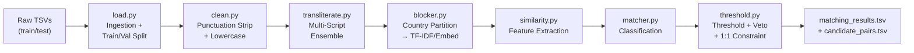
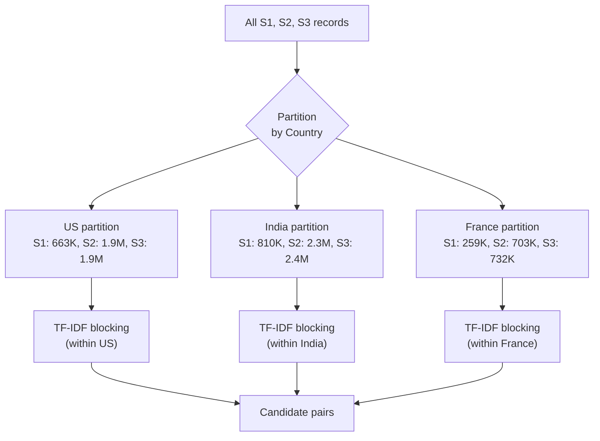
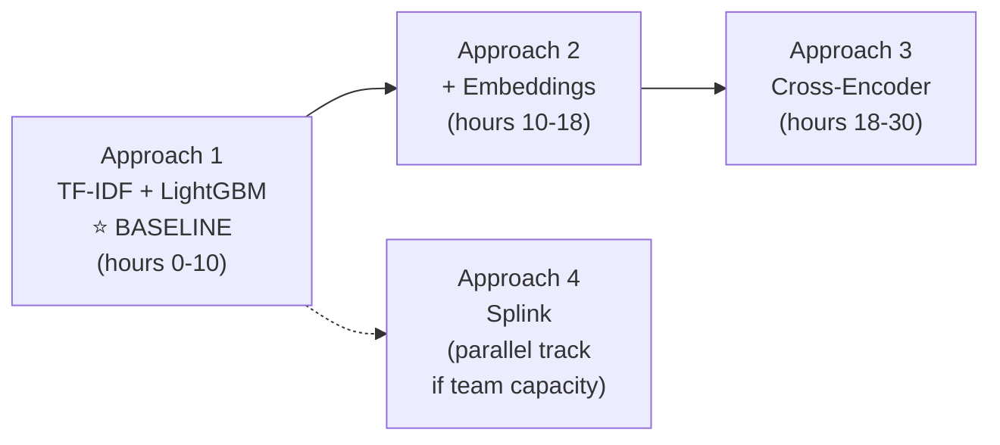

> **Version:** v4.1 | **Last updated:** 2026-09-26 02:58 IST | **By:** Antigravity

# Architecture — Business Entity Resolution Pipeline

**Standalone primer:** Amazon ML Challenge 2026 — 72-hour hackathon (Sep 25–27). Match noisy business records from 3 sources (~24M records) to deduplicated S1 reference entities. Metric is F₀.₅ (precision-heavy). This document is the **design blueprint** for the entire pipeline — repo layout, data flow, validation, modeling, and risk management.

---

## Table of Contents

1. [Repo / Code Layout](#1-repo--code-layout)
2. [Data Pipeline Design](#2-data-pipeline-design)
3. [Validation Strategy](#3-validation-strategy)
4. [Model Shortlist](#4-model-shortlist)
5. [Experiment Tracking & Agent Skills](#5-experiment-tracking--agent-skills)
6. [Training Diagnostics & Observability](#6-training-diagnostics--observability)
7. [Risk List](#7-risk-list)
8. [Additional Considerations](#8-additional-considerations)

---

## 1. Repo / Code Layout

### Design Principle

> The **`SUBMISSION/`** folder is the self-contained submission package — everything a reviewer needs to reproduce our results end-to-end. Everything outside it is build-time scaffolding: context docs, notebooks, research, scripts — not for public display.

### Directory Structure

```
AmazonMLChallenge_2026/                     # ← workspace root
│
├── SUBMISSION/                             # 🔒 SUBMISSION PACKAGE — ships as-is
│   ├── code/business_entity_resolution/
│   │   ├── src/
│   │   │   ├── __init__.py
│   │   │   ├── main.py                    # Single entry point: `python src/main.py`
│   │   │   ├── config.py                  # All paths, hyperparams, thresholds
│   │   │   │
│   │   │   ├── preprocessing/
│   │   │   │   ├── __init__.py
│   │   │   │   ├── load.py                # Data ingestion (train/test TSV loading)
│   │   │   │   ├── clean.py               # Text normalization (punctuation-only strip)
│   │   │   │   └── transliterate.py       # Multi-script → Latin conversion (ensemble)
│   │   │   │
│   │   │   ├── blocking/
│   │   │   │   ├── __init__.py
│   │   │   │   └── blocker.py             # Country-first + TF-IDF/embedding blocking
│   │   │   │
│   │   │   ├── features/
│   │   │   │   ├── __init__.py
│   │   │   │   └── similarity.py          # Pairwise feature extraction
│   │   │   │
│   │   │   ├── models/
│   │   │   │   ├── __init__.py
│   │   │   │   └── matcher.py             # Train / predict logic (LightGBM)
│   │   │   │
│   │   │   ├── postprocessing/
│   │   │   │   ├── __init__.py
│   │   │   │   └── threshold.py           # Threshold tuning, one-to-one constraint, output formatting
│   │   │   │
│   │   │   └── evaluation/
│   │   │       ├── __init__.py
│   │   │       └── metrics.py             # F₀.₅ scorer + CV harness
│   │   │
│   │   ├── README.md                      # Reproduction guide (ships in zip)
│   │   └── requirements.txt               # Dependency list (ships in zip)
│   │
│   ├── output/
│   │   ├── matching_results.tsv           # Current leaderboard submission
│   │   ├── history/                       # Numbered historical matching TSVs
│   │   └── candidate_pairs.tsv            # Local blocking audit (not tracked)
│   │
│   └── Documentation_template.md          # Official methodology write-up
│
├── skills/                                 # 🤖 Canonical tracked, provider-agnostic Agent Skills
│   ├── log-experiment/SKILL.md
│   ├── validate-submission/SKILL.md
│   ├── eda-report/SKILL.md
│   ├── new-experiment/SKILL.md
│   ├── notebook-to-script/SKILL.md
│   ├── sync-writeup/SKILL.md
│   └── reconcile-project/SKILL.md
│
├── context/                                # 📖 BUILD-TIME DOCS (not submitted)
│   ├── architecture.md                    # ← THIS FILE
│   ├── problem-and-data.md
│   ├── eda-findings.md
│   ├── experiment-log.md
│   ├── submission-log.md
│   ├── umbrella-research.md
│   ├── environment-setup.md
│   ├── git-workflow.md
│   ├── team-roles.md
│   └── writeup-draft.md
│
├── notebooks/                              # 📓 EDA & diagnostics (not submitted)
│   └── (exploration notebooks)
│
├── scripts/                                # 🔧 Build utilities (not submitted)
│   ├── package_submission.py              # Zip builder
│
├── analysis and research/                  # 📚 Pre-comp research (not submitted)
├── data/                                    # 📦 Raw data — .gitignore'd, READ-ONLY
├── amazon docs given/                      # Official PDFs
├── project.md                              # Master index
└── agents.md                               # AI agent operating manual
```

### Module Responsibilities

| Module | Responsibility | Key I/O |
|--------|---------------|---------|
| `preprocessing/load.py` | Read TSVs with `sep='\t'`, validate schema, create train/val split | Raw TSVs → DataFrames + validation split |
| `preprocessing/clean.py` | Lowercase, strip punctuation only, handle nulls. **Preserve legal suffixes and Unicode.** | DataFrame → DataFrame with `clean_name`, `clean_address` |
| `preprocessing/transliterate.py` | Multi-script → Latin conversion via script-specific ensemble | DataFrame → DataFrame with transliterated fields |
| `blocking/blocker.py` | Country-first partitioning plus TF-IDF candidate generation per country | DataFrames -> `candidate_pairs.tsv` + pair DataFrame |
| `features/similarity.py` | Compute string similarities, token overlaps, length ratios, numeric address overlap, and source indicator | Pair DataFrame -> 14-column feature matrix |
| `models/matcher.py` | Train classifier, predict match probabilities | Features + labels → Model + probabilities |
| `postprocessing/threshold.py` | Tune threshold, enforce one-to-one S2/S3 assignment, and format output | Probabilities -> `matching_results.tsv` |
| `evaluation/metrics.py` | Compute F₀.₅ (per-entity + macro-averaged), CV harness, diagnostic plots | Predictions + ground truth → Score + charts |

### Notebooks vs Scripts

| Location | Purpose | Rule |
|----------|---------|------|
| `notebooks/` | EDA, diagnostics, visualization, quick prototyping | Clear outputs before committing; never import from notebooks |
| `SUBMISSION/code/.../src/` | All production pipeline logic | `.py` modules only; importable; tested |
| `scripts/` | One-off utilities (packaging, experiment runner) | Not shipped in submission |

---

## 2. Data Pipeline Design

### Overview Flow



**Performance Principle:** The pipeline processes millions of records. Stages MUST use multiprocessing/multithreading to maximize CPU utilization. Furthermore, proactive bottleneck resolution is required: if any process takes an unreasonably long time, it must be stopped, optimized (e.g. eliminating slow pandas loops), and restarted. Always do a full pass for performance bottlenecks before execution to ensure the fastest possible runtime. Finally, implement pipeline caching (saving intermediate features, blocked candidates, etc.) to prevent work loss if a run crashes.

### Stage 1: Ingestion & Validation Split (`load.py`)

**Input:** 6 TSV files (3 train, 3 test) + 1 ground truth TSV.

**Operations:**
- Read with `pd.read_csv(..., sep='\t')` — enforced, never comma-separated
- Validate expected columns: `entity_id`, `business_name`, `business_address`, `country`
- Ground truth format: `source1_entity_id`, `matched_entity_ids` (comma-separated list or NaN for singletons)
- Add a `source` column (`S1`, `S2`, `S3`) based on entity_id prefix for convenience
- Optional: `SAMPLE_FRAC` config for fast dev iterations (sample from S1 and carry over matched S2/S3)

**Validation Split (CRITICAL — no ground truth exists for test data):**
- The test data provided has **no ground truth** — we cannot evaluate locally on it
- Create a held-out validation split from training data:
  - **80/20 stratified split on S1 entities by country**
  - The 20% held-out S1 entities and their matched S2/S3 records become the validation set
  - Unmatched S2/S3 records (distractors) are split proportionally
  - This validation set is used for threshold tuning and final model selection
  - CV on the 80% training portion handles model/feature selection

**Key data facts:**
> See [`problem-and-data.md`](problem-and-data.md) for the canonical dataset statistics, constraints, and distribution facts.

### Stage 2: Cleaning (`clean.py`)

**Design Decision: Preserve legal suffixes. Strip punctuation only. Preserve Unicode.**

The F₀.₅ metric is precision-heavy. Stripping legal suffixes like "Private Limited" or "Inc" would lose discriminative information and increase false positives (e.g., "ABC Private Limited" vs "ABC Public Limited" would become identical). This is unacceptable.

**Operations:**
1. **Null handling:** Replace NaN with empty string (~2-59 null names in S2/S3, ~3.3% missing addresses in S2/S3)
2. **Lowercasing:** `text.lower()` (Unicode-aware, handles French accents correctly)
3. **Legal suffix normalization (NORMALIZE, NOT STRIP):** `pvt` / `pvt.` → `private`; `ltd` / `ltd.` → `limited`; `inc.` → `inc` — but NEVER remove them
4. **Punctuation-only removal:** Strip punctuation marks (`.`, `,`, `-`, `'`, `"`, etc.) but **preserve all Unicode letters** (Latin, Devanagari, Bengali, Tamil, French accented, etc.)
   - Regex: `re.sub(r'[^\w\s]', ' ', text)` (Unicode-aware `\w` preserves letters + digits in all scripts)
   - NOT `[^a-z0-9\s]` which destroys everything non-ASCII
5. **Whitespace normalization:** Collapse multiple spaces

**Current implementation:** See [`clean.py`](../SUBMISSION/code/business_entity_resolution/src/preprocessing/clean.py) for the Unicode-preserving punctuation cleanup and suffix normalization.

### Stage 3: Multi-Script Transliteration Ensemble (`transliterate.py`)

**Key finding from EDA:** S1 is 100% Latin script (0 non-Latin characters). S2 has ~17% non-Latin records, S3 has ~13%. Transliteration is a one-way operation: convert S2/S3 non-Latin → Latin to match S1.

**Implemented baseline:** `transliterate.py` routes supported Indic scripts to `indic-transliteration` ITRANS and folds French combining accents with the standard library. S1 passes through unchanged. The optional multilingual model approaches below are not part of the current baseline.

### Stage 4: Blocking / Candidate Generation (`blocker.py`)

**Strategy: Country-first partitioning, then within-country blocking.**

#### Why country-first is correct and mandatory:

- **EDA CONFIRMED:** Zero cross-country matches exist in the training data (0 out of 7,638,365 pairs)
- A business in one country **cannot** be the same entity as a business in another country
- Country blocking alone reduces the search space by ~60% (only compare within the same country)
- This is a **hard partition**, not a soft filter — it's a veto rule

#### Blocking pipeline:



#### Within-country blocking (implemented TF-IDF word unigrams):

1. Build TF-IDF vectors on `clean_name + " " + clean_address` for S1 records in this country
2. For each S2/S3 record in the same country, find top-K nearest S1 neighbors via sparse cosine similarity
3. Config: word analyzer, `TFIDF_NGRAM_RANGE = (1, 1)`, `TFIDF_MAX_FEATURES = 100_000`, `max_df = 0.01`, and `BLOCKING_TOP_K = 20` (see `src/config.py` and `src/blocking/blocker.py`).

#### BLOCKING_TOP_K calibration:

Based on EDA analysis:
- Each S2/S3 record maps to **at most 1** S1 entity
- Max matches per S1 entity: 11 (but this is S1→S2+S3, not the reverse)
- The blocking question is: "for a given S2/S3 record, is its true S1 match in the top-K?"
- K=20 should be very generous for finding a single correct S1
- **Must measure blocking recall on training data** to validate (target ≥ 98%)
- Can start with K=20, increase if recall is low

#### Optional enhancement: Semantic embedding blocking (if time allows):
- Embed business names with `LaBSE` or `E5-multilingual-small` via FAISS
- Particularly useful for cross-script matches and French zero-shot
- Can be a second blocking pass, merged with TF-IDF candidates (union)

**Output:** `candidate_pairs.tsv` (S1 → comma-separated S2/S3 candidate IDs) + in-memory pair DataFrame.

### Stage 5: Feature Extraction (`similarity.py`)

**Input:** Candidate pairs from blocking.

**Implemented features** (see `src/features/similarity.py`):

- Name and address Jaro-Winkler, Levenshtein ratio, token-sort ratio, and token-set ratio.
- Name and address token-overlap Jaccard and length ratios.
- Shared numeric address tokens and an S2/S3 source indicator.

Embedding, phonetic, country-encoded, and prefix/suffix features are not in the current feature matrix.

### Stage 6: Classification (`matcher.py`)

See [Model Shortlist](#4-model-shortlist).

### Stage 7: Post-processing (`threshold.py`)

**Implemented behavior:** Sweep thresholds on validation F0.5, keep the highest-confidence candidate when an S2/S3 ID is assigned to multiple S1 entities, and write matching and candidate TSV outputs. Country partitioning happens during blocking. The output row count is defined by the test S1 input; see `context/problem-and-data.md`. Train mode runs the submission validator after writing outputs.

---

## 3. Validation Strategy

### Train/Validation Split

Since the test data has **no ground truth**, all evaluation must happen on training data.

**Split design:**
- **80% Train / 20% Validation**, stratified by country on S1 entities
- The 20% S1 entities + their matched S2/S3 + proportional distractors = validation set
- This validation set is held out for:
  - **Threshold tuning** (sweep to maximize F₀.₅)
  - **Final model selection** (which approach to submit)
  - **Diagnostic analysis** (which entity types / countries fail)

### CV Scheme (within the 80% training portion)

**Stratified Group K-Fold on S1 entities, by country.**

- **Group on S1 entity_id:** All matches for a given S1 entity must stay in the same fold — prevents entity identity leakage
- **Stratify by country:** Ensure each fold has proportional US/India representation
- **K = 5:** ~350K S1 entities per fold — large enough for stable estimates

### Evaluation Protocol

1. **Per-entity scoring:** Compute F₀.₅ exactly as the leaderboard does:
   - Per S1 entity: compute precision and recall of matched set vs ground truth
   - Singletons with empty prediction → 1.0; singletons with any prediction → 0.0
   - Macro-average across all S1 entities in the fold
2. **Mean ± std across 5 folds:** Report both for experiment log
3. **Validation set scoring:** Score the held-out 20% for final model comparison
4. **Full-train final model:** After selecting best approach, retrain on 100% training data for submission

### Anti-Overfitting Measures

- **Never tune on public LB score.** Use CV + validation set exclusively.
- **Threshold tuning on validation set only** — never on the CV training folds
- **Log every experiment** in `context/experiment-log.md` with CV score (via `log-experiment` skill)
- **France proxy:** Cannot validate France directly (zero training data). Ensure pipeline doesn't crash on French data. Use multilingual embeddings for generalization.

### Fast Dev Loop

Training defaults to the full dataset. Lower `SAMPLE_FRAC` in `src/config.py` for sampled development runs; the active default is recorded in [`project.md`](../project.md).
- Full run only for CV scoring and submission generation

---

## 4. Model Shortlist

Given: F₀.₅ metric (precision-heavy), ~24M records, 72-hour budget, ≤8B parameters, no external data.

### Implemented baseline: Country-Partitioned Word-Unigram TF-IDF + LightGBM

| Aspect | Detail |
|--------|--------|
| **What** | Country partition + word-unigram TF-IDF + 14 pairwise features + LightGBM classifier |
| **Why** | Fastest to iterate, no GPU needed, handles tabular features natively, already in requirements |
| **F₀.₅ optimization** | Tune decision threshold on validation set to maximize F₀.₅; can use `scale_pos_weight` to bias toward precision |

### Approach 2: + Multilingual Embedding Features (Enhancement)

| Aspect | Detail |
|--------|--------|
| **What** | Add embedding cosine similarity as extra features to Approach 1 LightGBM |
| **Candidates** | `LaBSE` (~470M, MIT), `E5-multilingual-small` (~118M, MIT), `MuRIL` (~236M, Apache 2.0) |
| **Why** | Handles cross-script (S2/S3 Indic → S1 Latin) and French zero-shot far better than string features |
| **Expected time** | ~4-8 hours incremental (embedding is the bottleneck) |

### Approach 3: Cross-Encoder Re-ranker for Hard Cases (Enhancement)

| Aspect | Detail |
|--------|--------|
| **What** | For uncertain LightGBM pairs (probability 0.3–0.7), pass through a cross-encoder |
| **Candidate** | `XLM-RoBERTa-base` (~279M, MIT) fine-tuned on training pairs |
| **Why** | SOTA for pairwise similarity; handles the hardest ~5-10% of cases |
| **Expected time** | ~8-12 hours (fine-tuning + inference on uncertain pairs only) |

### Approach 4: Splink Probabilistic Record Linkage (Alternative baseline)

| Aspect | Detail |
|--------|--------|
| **What** | Splink (Fellegi-Sunter) on DuckDB for end-to-end probabilistic linkage |
| **Why** | Purpose-built for this task; handles blocking + comparison + scoring in one framework |
| **Expected time** | ~4-6 hours to configure |
| **Risk** | Less flexible; team needs to learn Splink API |

### Optional future approaches



> [!IMPORTANT]
> **Approach 1 is the implemented baseline.** The remaining approaches below are optional extensions, not current pipeline components.

---

## 5. Experiment Tracking & Agent Skills

### Agent Skills System

The tracked, provider-agnostic skills live in `skills/`; provider directories contain copies for some existing skills:

| Skill | Trigger | What It Does |
|-------|---------|--------------|
| `log-experiment` | After training run completes | Appends row to `context/experiment-log.md`, updates `project.md` if new best |
| `validate-submission` | Before zipping submission | Runs `validate_submission.py` against output files |
| `eda-report` | After data exploration | Appends findings to `context/eda-findings.md` + `context/problem-and-data.md` |
| `new-experiment` | Starting new approach | Creates `exp/` branch, scaffolds from current best config |
| `notebook-to-script` | Modularizing notebook code | Extracts logic to `.py` modules under `SUBMISSION/code/.../src/` |
| `sync-writeup` | Updating methodology doc | Pulls best score + architecture into `context/writeup-draft.md` |
| `reconcile-project` | After milestone / before packaging | Audits docs against the repository and logs findings |

Experiment logging is append-only and follows [`skills/log-experiment/SKILL.md`](../skills/log-experiment/SKILL.md). The experiment log is the canonical record of model runs.

---

## 6. Training Diagnostics & Observability

Every training run should produce diagnostic outputs to guide architecture improvements.

### Mandatory Diagnostics (generated automatically)

| Diagnostic | Purpose | Format |
|-----------|---------|--------|
| **Blocking recall** | What % of true matches survive blocking? | Print + log |
| **Feature importance** | Which features drive the LightGBM model? | Bar chart (matplotlib) |
| **Score vs threshold curve** | How F₀.₅ / precision / recall change with threshold | Line chart |
| **Confusion matrix** | TP / FP / FN / TN breakdown | Heatmap |
| **Per-country F₀.₅** | Score breakdown by US / India | Table + bar chart |
| **Error analysis: worst S1 entities** | S1 entities with lowest per-entity F₀.₅ | Table (top 50 worst) |
| **Score distribution** | Histogram of match probabilities for true matches vs non-matches | Overlapping histogram |
| **Singleton accuracy** | How well we identify singletons (predict empty) | Precision/recall on singleton class |

### Optional Diagnostics (on demand)

| Diagnostic | Purpose |
|-----------|---------|
| **Match count calibration** | Predicted vs actual match counts per S1 entity |
| **Feature correlation matrix** | Detect redundant features |
| **Learning curve** | F₀.₅ vs training set size (detect underfitting) |
| **Cross-script performance** | F₀.₅ on S2/S3 records with non-Latin vs Latin script |
| **Distractor rejection rate** | What % of distractors are correctly rejected |

### Where Diagnostics Live

- **Charts:** Saved to `notebooks/diagnostics/` (PNG files, not committed if large)
- **Summary stats:** Printed to stdout + captured in experiment log notes column
- **Interactive exploration:** Jupyter notebooks in `notebooks/`

---

## 7. Current Risks and Open Items

- **Full-scale resource use:** Training now defaults to all available training data. Lower `SAMPLE_FRAC` in `src/config.py` for development attempts.
- **Zero-shot France:** France has no training labels; current baseline behavior should be read as unvalidated for that country.
│   └── reconciliation-log.md
- **Output validation:** Run the official validator before packaging or submission.

The former scaffold/path/count risks were resolved or superseded. The reconciliation log records which outdated items were removed and why.

---

## 8. Additional Considerations

### 8.1 Submission History

│   │   ├── history/                       # Numbered historical matching TSVs

### 8.4 Data Leakage Checklist

Before each experiment, verify:
- [ ] No test data used in training
- [ ] No ground truth used during feature engineering on test set
- [ ] CV splits group on S1 entity_id (no entity leaks across folds)
- [ ] Threshold tuned on validation set, not training folds
- [ ] Blocking parameters not tuned on test set

### 8.5 Dependency Licensing Audit

| Library | License | Status |
|---------|---------|--------|
| pandas | BSD-3 | ✅ Compatible |
| numpy | BSD-3 | ✅ Compatible |
| scikit-learn | BSD-3 | ✅ Compatible |
| rapidfuzz | MIT | ✅ OK |
| python-Levenshtein | MIT | ✅ OK |
| xgboost | Apache 2.0 | ✅ OK |
| lightgbm | MIT | ✅ OK |
| indic-transliteration | MIT | ✅ OK |
| tqdm | MIT/MPL | ✅ OK |
| sentence-transformers | Apache 2.0 | ✅ OK (if used) |
| torch | BSD-3 | ✅ Compatible |
| FAISS | MIT | ✅ OK (if used) |
| unidecode | GPL | ⚠️ **GPL — may violate constraint. Use `unicodedata` stdlib instead.** |

### 8.6 Memory & Compute Estimates (per country partition)

Country partitioning reduces memory by ~60% compared to full dataset operations.

| Operation | Estimated Memory | Estimated Time | Notes |
|-----------|-----------------|----------------|-------|
| Load all train TSVs | ~8-12 GB | 2-5 min | 12.5M records × 4 string columns |
| Load all test TSVs | ~6-10 GB | 2-4 min | 11.7M records × 4 string columns |
| TF-IDF vectorization (largest country) | ~1-2 GB sparse | 3-8 min | ~1.3M S1 docs (US) |
| TF-IDF blocking (per country) | ~2-4 GB | 2-5 min | Top-K sparse search (multithreaded/chunked) |
| Feature extraction (all pairs) | ~4-8 GB | 2-5 min | Multiprocessing on all available cores |
| LightGBM training | ~1-2 GB | 5-15 min | Fast on tabular |
| Embedding (per source, GPU) | ~4 GB GPU | 2-6 hours | Batched; GPU strongly preferred |

---

## 9. V2 Architecture (GPU Semantic Blocking)

**Context:** The V1 Baseline (TF-IDF + LightGBM) achieved a 0.697 LB score but exposed severe time complexity limits when dealing with 10M+ strings. The top LB score is 0.9884. To close this gap before the 12:00 PM Core Build deadline (Sep 26), we are pivoting to a GPU-accelerated Semantic Blocking approach.

### Key Tenets
1. **Semantic Blocking is the Secret Sauce:** We must prioritize blocking recall (F0.5 still requires precision, but ML will handle that later). We need an optimal, GPU-accelerated blocking algorithm with better time complexity than sparse $O(N^2)$ dot products.
2. **Hardware Constraint Awareness:** The architecture MUST run within the local hardware constraints and competition time limits. No fantasy architectures.
3. **Pretrained Models:** Stand on the shoulders of giants. Use highly optimized, pretrained dense retrievers (e.g., `sentence-transformers`, `Faiss` GPU indexing) instead of training from scratch.

### Proposed Blocking Algorithms for V2
- **Dense Retrieval with Faiss (GPU):** Embed all entity names/addresses using a fast, lightweight multilingual embedding model (e.g., `paraphrase-multilingual-MiniLM-L12-v2`). Index S1 using `faiss.IndexFlatIP` (or `IndexIVFFlat` for speed) on the GPU, and query S2/S3. This brings time complexity down to $O(N \log N)$ and completes in seconds on a GPU.
- **Bi-Encoders:** For semantic representation that captures transliteration discrepancies far better than character n-grams.

---

## Changelog
| Version | Date | By | Summary |
|---------|------|----|---------|
| v4.1 | 2026-09-26 | Antigravity | Added V2 Architecture (GPU Semantic Blocking) plan. |
| v4.0 | 2026-09-26 | Codex | Reconciled the architecture with implemented pipeline behavior, tracked paths, active risks, and current submission history. |
| v3.0 | 2026-09-26 | Antigravity | Replaced data facts with canonical link and removed team split to align with Single Source of Truth Rule. |
| v2.3 | 2026-09-25 | Antigravity | Updated Performance Principle to include pipeline caching/checkpointing |
| v2.2 | 2026-09-25 | Antigravity | Updated Performance Principle to include proactive bottleneck resolution |
| v2.1 | 2026-09-25 | Antigravity | Added performance principle requiring multiprocessing to maximize hardware utilization |
| v2.0 | 2026-09-25 | Antigravity | Major rewrite: integrated EDA findings (country blocking verified safe, S1 100% Latin, script stats), country-first blocking strategy, validation split design, training diagnostics section, skills system integration, legal suffix preservation rule, Unicode-safe cleaning, multi-script ensemble transliteration, fixed package_submission.py path. Resolved all v1.0 open questions. |
| v1.0 | 2026-09-25 | Antigravity | Initial architecture document |
