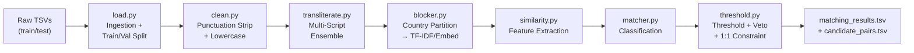
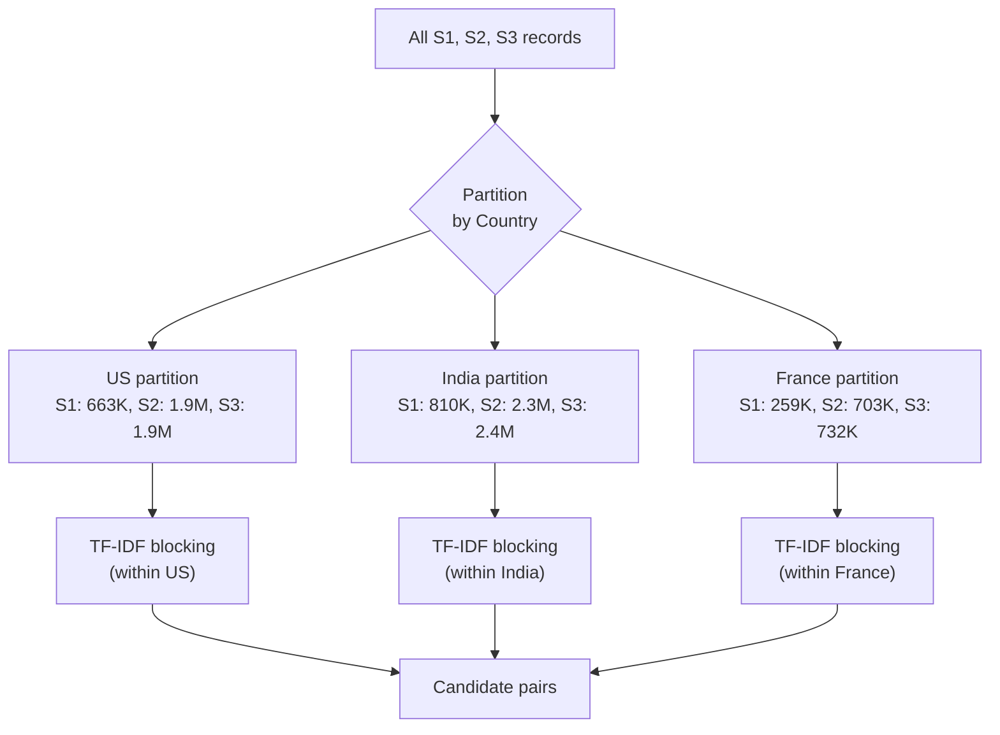
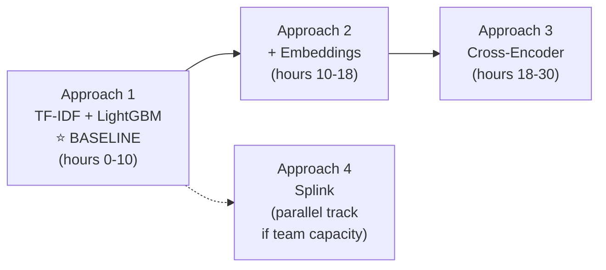

> **Version:** v2.3 | **Last updated:** 2026-09-25 19:30 IST | **By:** Antigravity

# Architecture — Business Entity Resolution Pipeline

**Standalone primer:** Amazon ML Challenge 2026 — 72-hour hackathon (Sep 25–27). Match noisy business records from 3 sources (~24M records) to deduplicated S1 reference entities. Metric is F₀.₅ (precision-heavy). This document is the **design blueprint** for the entire pipeline — repo layout, data flow, validation, modeling, and risk management.

---

## Table of Contents

1. [Repo / Code Layout](#1-repo--code-layout)
2. [Data Pipeline Design](#2-data-pipeline-design)
3. [Validation Strategy](#3-validation-strategy)
4. [Model Shortlist](#4-model-shortlist)
5. [Experiment Tracking & Agent Skills](#5-experiment-tracking--agent-skills)
6. [Training Diagnostics & Observability](#6-training-diagnostics--observability)
7. [Risk List](#7-risk-list)
8. [Additional Considerations](#8-additional-considerations)

---

## 1. Repo / Code Layout

### Design Principle

> The **`SUBMISSION/`** folder is the self-contained submission package — everything a reviewer needs to reproduce our results end-to-end. Everything outside it is build-time scaffolding: context docs, notebooks, research, scripts — not for public display.

### Directory Structure

```
AmazonMLChallenge_2026/                     # ← workspace root
│
├── SUBMISSION/                             # 🔒 SUBMISSION PACKAGE — ships as-is
│   ├── code/business_entity_resolution/
│   │   ├── src/
│   │   │   ├── __init__.py
│   │   │   ├── main.py                    # Single entry point: `python src/main.py`
│   │   │   ├── config.py                  # All paths, hyperparams, thresholds
│   │   │   │
│   │   │   ├── preprocessing/
│   │   │   │   ├── __init__.py
│   │   │   │   ├── load.py                # Data ingestion (train/test TSV loading)
│   │   │   │   ├── clean.py               # Text normalization (punctuation-only strip)
│   │   │   │   └── transliterate.py       # Multi-script → Latin conversion (ensemble)
│   │   │   │
│   │   │   ├── blocking/
│   │   │   │   ├── __init__.py
│   │   │   │   └── blocker.py             # Country-first + TF-IDF/embedding blocking
│   │   │   │
│   │   │   ├── features/
│   │   │   │   ├── __init__.py
│   │   │   │   └── similarity.py          # Pairwise feature extraction
│   │   │   │
│   │   │   ├── models/
│   │   │   │   ├── __init__.py
│   │   │   │   └── matcher.py             # Train / predict logic (XGBoost/LightGBM)
│   │   │   │
│   │   │   ├── postprocessing/
│   │   │   │   ├── __init__.py
│   │   │   │   └── threshold.py           # Threshold tuning, veto rules, output formatting
│   │   │   │
│   │   │   └── evaluation/
│   │   │       ├── __init__.py
│   │   │       └── metrics.py             # F₀.₅ scorer + CV harness
│   │   │
│   │   ├── README.md                      # Reproduction guide (ships in zip)
│   │   └── requirements.txt               # Pinned deps (ships in zip)
│   │
│   ├── output/
│   │   ├── matching_results.tsv           # Leaderboard submission (1,732,544 rows)
│   │   └── candidate_pairs.tsv            # Blocking audit
│   │
│   └── Documentation_template.md          # Official methodology write-up
│
├── .agents/skills/                         # 🤖 AGENT SKILLS (provider-agnostic)
│   ├── log-experiment/SKILL.md
│   ├── validate-submission/SKILL.md
│   ├── eda-report/SKILL.md
│   ├── new-experiment/SKILL.md
│   ├── notebook-to-script/SKILL.md
│   └── sync-writeup/SKILL.md
│
├── context/                                # 📖 BUILD-TIME DOCS (not submitted)
│   ├── architecture.md                    # ← THIS FILE
│   ├── problem-and-data.md
│   ├── eda-findings.md
│   ├── experiment-log.md
│   ├── submission-log.md
│   ├── umbrella-research.md
│   ├── environment-setup.md
│   ├── git-workflow.md
│   ├── team-roles.md
│   └── writeup-draft.md
│
├── notebooks/                              # 📓 EDA & diagnostics (not submitted)
│   └── (exploration notebooks)
│
├── scripts/                                # 🔧 Build utilities (not submitted)
│   ├── package_submission.py              # Zip builder
│   └── run_experiment.py                  # (proposed) Experiment runner with auto-logging
│
├── Analysis and Research/                  # 📚 Pre-comp research (not submitted)
├── Data/                                   # 📦 Raw data — .gitignore'd, READ-ONLY
├── amazon docs given/                      # Official PDFs
├── project.md                              # Master index
└── agents.md                               # AI agent operating manual
```

### Module Responsibilities

| Module | Responsibility | Key I/O |
|--------|---------------|---------|
| `preprocessing/load.py` | Read TSVs with `sep='\t'`, validate schema, create train/val split | Raw TSVs → DataFrames + validation split |
| `preprocessing/clean.py` | Lowercase, strip punctuation only, handle nulls. **Preserve legal suffixes and Unicode.** | DataFrame → DataFrame with `clean_name`, `clean_address` |
| `preprocessing/transliterate.py` | Multi-script → Latin conversion via script-specific ensemble | DataFrame → DataFrame with transliterated fields |
| `blocking/blocker.py` | Country-first partitioning → TF-IDF/embedding candidate generation per country | DataFrames → `candidate_pairs.tsv` + pair DataFrame |
| `features/similarity.py` | Compute pairwise features: string similarities, token overlaps, phonetic, embedding cosine | Pair DataFrame → Feature matrix |
| `models/matcher.py` | Train classifier, predict match probabilities | Features + labels → Model + probabilities |
| `postprocessing/threshold.py` | Tune threshold on F₀.₅, apply veto rules, enforce one-to-one S2/S3 constraint, format output | Probabilities → `matching_results.tsv` |
| `evaluation/metrics.py` | Compute F₀.₅ (per-entity + macro-averaged), CV harness, diagnostic plots | Predictions + ground truth → Score + charts |

### Notebooks vs Scripts

| Location | Purpose | Rule |
|----------|---------|------|
| `notebooks/` | EDA, diagnostics, visualization, quick prototyping | Clear outputs before committing; never import from notebooks |
| `SUBMISSION/code/.../src/` | All production pipeline logic | `.py` modules only; importable; tested |
| `scripts/` | One-off utilities (packaging, experiment runner) | Not shipped in submission |

---

## 2. Data Pipeline Design

### Overview Flow



**Performance Principle:** The pipeline processes millions of records. Stages MUST use multiprocessing/multithreading to maximize CPU utilization. Furthermore, proactive bottleneck resolution is required: if any process takes an unreasonably long time, it must be stopped, optimized (e.g. eliminating slow pandas loops), and restarted. Always do a full pass for performance bottlenecks before execution to ensure the fastest possible runtime. Finally, implement pipeline caching (saving intermediate features, blocked candidates, etc.) to prevent work loss if a run crashes.

### Stage 1: Ingestion & Validation Split (`load.py`)

**Input:** 6 TSV files (3 train, 3 test) + 1 ground truth TSV.

**Operations:**
- Read with `pd.read_csv(..., sep='\t')` — enforced, never comma-separated
- Validate expected columns: `entity_id`, `business_name`, `business_address`, `country`
- Ground truth format: `source1_entity_id`, `matched_entity_ids` (comma-separated list or NaN for singletons)
- Add a `source` column (`S1`, `S2`, `S3`) based on entity_id prefix for convenience
- Optional: `SAMPLE_FRAC` config for fast dev iterations (sample from S1 and carry over matched S2/S3)

**Validation Split (CRITICAL — no ground truth exists for test data):**
- The test data provided has **no ground truth** — we cannot evaluate locally on it
- Create a held-out validation split from training data:
  - **80/20 stratified split on S1 entities by country**
  - The 20% held-out S1 entities and their matched S2/S3 records become the validation set
  - Unmatched S2/S3 records (distractors) are split proportionally
  - This validation set is used for threshold tuning and final model selection
  - CV on the 80% training portion handles model/feature selection

**Key data facts (from EDA — grounded in actual analysis):**

| Fact | Value | Source |
|------|-------|--------|
| Train S1 | 2,206,821 records | Direct measurement |
| Train S2 | 5,034,616 records | Direct measurement |
| Train S3 | 5,285,603 records | Direct measurement |
| Test S1 | 1,732,544 records | Direct measurement |
| Test S2 | 4,887,273 records | Direct measurement |
| Test S3 | 5,082,316 records | Direct measurement |
| Singletons (train) | 123,247 (5.58%) | Ground truth analysis |
| Median matches per S1 | 4 | Ground truth analysis |
| Max matches per S1 | 11 | Ground truth analysis |
| 99.99th %ile matches | 10 | Ground truth analysis |
| S2 per S1 (mean / max) | 1.77 / 5 | Ground truth analysis |
| S3 per S1 (mean / max) | 1.89 / 6 | Ground truth analysis |
| S2 distractors | 1,340,997 (26.6%) | Ground truth analysis |
| S3 distractors | 1,340,857 (25.4%) | Ground truth analysis |
| S2/S3 uniqueness | Each maps to exactly 1 S1 (0 duplicates) | Ground truth analysis |
| Cross-country matches | **0 out of 7,638,365** | Full exhaustive check |

### Stage 2: Cleaning (`clean.py`)

**Design Decision: Preserve legal suffixes. Strip punctuation only. Preserve Unicode.**

The F₀.₅ metric is precision-heavy. Stripping legal suffixes like "Private Limited" or "Inc" would lose discriminative information and increase false positives (e.g., "ABC Private Limited" vs "ABC Public Limited" would become identical). This is unacceptable.

**Operations:**
1. **Null handling:** Replace NaN with empty string (~2-59 null names in S2/S3, ~3.3% missing addresses in S2/S3)
2. **Lowercasing:** `text.lower()` (Unicode-aware, handles French accents correctly)
3. **Legal suffix normalization (NORMALIZE, NOT STRIP):** `pvt` / `pvt.` → `private`; `ltd` / `ltd.` → `limited`; `inc.` → `inc` — but NEVER remove them
4. **Punctuation-only removal:** Strip punctuation marks (`.`, `,`, `-`, `'`, `"`, etc.) but **preserve all Unicode letters** (Latin, Devanagari, Bengali, Tamil, French accented, etc.)
   - Regex: `re.sub(r'[^\w\s]', ' ', text)` (Unicode-aware `\w` preserves letters + digits in all scripts)
   - NOT `[^a-z0-9\s]` which destroys everything non-ASCII
5. **Whitespace normalization:** Collapse multiple spaces

**⚠️ Current `clean.py` scaffold is broken:** Uses `[^a-z0-9\s]` which strips all Unicode. Must be fixed to `[^\w\s]` with `re.UNICODE`.

### Stage 3: Multi-Script Transliteration Ensemble (`transliterate.py`)

**Key finding from EDA:** S1 is 100% Latin script (0 non-Latin characters). S2 has ~17% non-Latin records, S3 has ~13%. Transliteration is a one-way operation: convert S2/S3 non-Latin → Latin to match S1.

**Ensemble approach — use the best tool for each script family:**

| Script Family | Coverage | Recommended Tool | License | Notes |
|---------------|----------|-----------------|---------|-------|
| **Devanagari** (Hindi, Marathi, Sanskrit) | Largest Indic share | `indic-transliteration` (ITRANS) or IndicXlit | MIT / MIT | Most Indian business names |
| **Bengali/Bangla** | Significant in India | `indic-transliteration` | MIT | |
| **Tamil** | South India | `indic-transliteration` | MIT | |
| **Telugu** | South India | `indic-transliteration` | MIT | |
| **Kannada** | South India | `indic-transliteration` | MIT | |
| **Malayalam** | South India | `indic-transliteration` | MIT | |
| **Gujarati** | West India | `indic-transliteration` | MIT | |
| **Gurmukhi** (Punjabi) | North India | `indic-transliteration` | MIT | |
| **Odia** | East India | `indic-transliteration` | MIT | |
| **French accented Latin** | ~15% of test | `unidecode` or `unicodedata.normalize('NFD')` + strip combining | PSF / stdlib | é→e, ç→c, etc. |

**Processing logic:**
1. **Detect script** per character using Unicode block ranges
2. **Route** to the appropriate transliterator based on detected script
3. **Transliterate** to Latin/ASCII
4. **For mixed-script text** (e.g., "ABC प्राइवेट लिमिटेड"): transliterate non-Latin portions, keep Latin portions
5. **French:** Normalize accented characters to ASCII equivalents (optional — can also leave as-is if similarity functions handle Unicode)

**Important:** Since S1 is always Latin, transliteration happens on S2/S3 only. S1 is passed through unchanged.

### Stage 4: Blocking / Candidate Generation (`blocker.py`)

**Strategy: Country-first partitioning, then within-country blocking.**

#### Why country-first is correct and mandatory:

- **EDA CONFIRMED:** Zero cross-country matches exist in the training data (0 out of 7,638,365 pairs)
- A business in one country **cannot** be the same entity as a business in another country
- Country blocking alone reduces the search space by ~60% (only compare within the same country)
- This is a **hard partition**, not a soft filter — it's a veto rule

#### Blocking pipeline:



#### Within-country blocking (TF-IDF character n-grams):

1. Build TF-IDF vectors on `clean_name + " " + clean_address` for S1 records in this country
2. For each S2/S3 record in the same country, find top-K nearest S1 neighbors via sparse cosine similarity
3. Config: `TFIDF_NGRAM_RANGE = (3, 3)`, `BLOCKING_TOP_K = 20`

#### BLOCKING_TOP_K calibration:

Based on EDA analysis:
- Each S2/S3 record maps to **at most 1** S1 entity
- Max matches per S1 entity: 11 (but this is S1→S2+S3, not the reverse)
- The blocking question is: "for a given S2/S3 record, is its true S1 match in the top-K?"
- K=20 should be very generous for finding a single correct S1
- **Must measure blocking recall on training data** to validate (target ≥ 98%)
- Can start with K=20, increase if recall is low

#### Optional enhancement: Semantic embedding blocking (if time allows):
- Embed business names with `LaBSE` or `E5-multilingual-small` via FAISS
- Particularly useful for cross-script matches and French zero-shot
- Can be a second blocking pass, merged with TF-IDF candidates (union)

**Output:** `candidate_pairs.tsv` (S1 → comma-separated S2/S3 candidate IDs) + in-memory pair DataFrame.

### Stage 5: Feature Extraction (`similarity.py`)

**Input:** Candidate pairs from blocking.

**Proposed features:**

| Feature | Library | Description |
|---------|---------|-------------|
| Jaro-Winkler (name) | `rapidfuzz` | Character-level similarity, good for typos |
| Levenshtein ratio (name) | `rapidfuzz` | Edit distance normalized |
| Token sort ratio (name) | `rapidfuzz` | Handles word reordering |
| Token set ratio (name) | `rapidfuzz` | Handles extra/missing tokens |
| Jaro-Winkler (address) | `rapidfuzz` | Address character similarity |
| Levenshtein ratio (address) | `rapidfuzz` | Address edit distance |
| Token overlap (name) | custom | Jaccard on word tokens |
| Token overlap (address) | custom | Jaccard on word tokens |
| Name length ratio | custom | `len(shorter) / len(longer)` |
| Address length ratio | custom | `len(shorter) / len(longer)` |
| Shared numeric tokens | custom | Count of matching numbers (address numbers, PINs) |
| Source indicator | custom | Whether candidate is S2 or S3 (different noise profiles) |
| Country (encoded) | custom | Country of the pair (may affect optimal thresholds) |

**Optional (if time allows):**
- Phonetic similarity (Soundex/Metaphone)
- Embedding cosine similarity (from blocking embeddings if FAISS path is used)
- TF-IDF cosine similarity (reuse blocking vectors)
- Prefix/suffix match features

### Stage 6: Classification (`matcher.py`)

See [Model Shortlist](#4-model-shortlist).

### Stage 7: Post-processing (`threshold.py`)

**Operations:**
1. **Threshold optimization:** Sweep probability threshold on held-out validation set to maximize F₀.₅ — NOT fixed at 0.5
2. **Veto rules:**
   - If country differs → reject (should already be blocked, but safety check)
   - If all numeric tokens in address differ entirely → reject (extra precision)
3. **One-to-one constraint enforcement (S2/S3 side):** Each S2/S3 record maps to at most one S1 entity. If a S2/S3 record is predicted to match multiple S1 entities, keep only the highest-confidence pair.
4. **Output formatting:**
   - `matching_results.tsv`: `source1_entity_id\tmatched_entity_ids` (comma-separated or empty)
   - Exactly 1,732,544 rows (one per S1 test entity)
   - `candidate_pairs.tsv`: Same format with `candidate_entity_ids` column, all candidates before threshold
5. **Validation:** Run `validate_submission.py` as final pipeline step (automated)

---

## 3. Validation Strategy

### Train/Validation Split

Since the test data has **no ground truth**, all evaluation must happen on training data.

**Split design:**
- **80% Train / 20% Validation**, stratified by country on S1 entities
- The 20% S1 entities + their matched S2/S3 + proportional distractors = validation set
- This validation set is held out for:
  - **Threshold tuning** (sweep to maximize F₀.₅)
  - **Final model selection** (which approach to submit)
  - **Diagnostic analysis** (which entity types / countries fail)

### CV Scheme (within the 80% training portion)

**Stratified Group K-Fold on S1 entities, by country.**

- **Group on S1 entity_id:** All matches for a given S1 entity must stay in the same fold — prevents entity identity leakage
- **Stratify by country:** Ensure each fold has proportional US/India representation
- **K = 5:** ~350K S1 entities per fold — large enough for stable estimates

### Evaluation Protocol

1. **Per-entity scoring:** Compute F₀.₅ exactly as the leaderboard does:
   - Per S1 entity: compute precision and recall of matched set vs ground truth
   - Singletons with empty prediction → 1.0; singletons with any prediction → 0.0
   - Macro-average across all S1 entities in the fold
2. **Mean ± std across 5 folds:** Report both for experiment log
3. **Validation set scoring:** Score the held-out 20% for final model comparison
4. **Full-train final model:** After selecting best approach, retrain on 100% training data for submission

### Anti-Overfitting Measures

- **Never tune on public LB score.** Use CV + validation set exclusively.
- **Threshold tuning on validation set only** — never on the CV training folds
- **Log every experiment** in `context/experiment-log.md` with CV score (via `log-experiment` skill)
- **France proxy:** Cannot validate France directly (zero training data). Ensure pipeline doesn't crash on French data. Use multilingual embeddings for generalization.

### Fast Dev Loop

- `SAMPLE_FRAC = 0.1` in `config.py` → 10% sample for rapid iteration
- Full run only for CV scoring and submission generation

---

## 4. Model Shortlist

Given: F₀.₅ metric (precision-heavy), ~24M records, 72-hour budget, ≤8B parameters, no external data.

### Approach 1: Country-Partitioned TF-IDF Blocking + LightGBM ⭐ (Baseline — build first)

| Aspect | Detail |
|--------|--------|
| **What** | Country partition → TF-IDF char n-gram blocking → pairwise string similarity features → LightGBM classifier |
| **Why** | Fastest to iterate, no GPU needed, handles tabular features natively, already in requirements |
| **Expected time** | ~6-10 hours to build end-to-end with CV |
| **F₀.₅ optimization** | Tune decision threshold on validation set to maximize F₀.₅; can use `scale_pos_weight` to bias toward precision |

### Approach 2: + Multilingual Embedding Features (Enhancement)

| Aspect | Detail |
|--------|--------|
| **What** | Add embedding cosine similarity as extra features to Approach 1 LightGBM |
| **Candidates** | `LaBSE` (~470M, MIT), `E5-multilingual-small` (~118M, MIT), `MuRIL` (~236M, Apache 2.0) |
| **Why** | Handles cross-script (S2/S3 Indic → S1 Latin) and French zero-shot far better than string features |
| **Expected time** | ~4-8 hours incremental (embedding is the bottleneck) |

### Approach 3: Cross-Encoder Re-ranker for Hard Cases (Enhancement)

| Aspect | Detail |
|--------|--------|
| **What** | For uncertain LightGBM pairs (probability 0.3–0.7), pass through a cross-encoder |
| **Candidate** | `XLM-RoBERTa-base` (~279M, MIT) fine-tuned on training pairs |
| **Why** | SOTA for pairwise similarity; handles the hardest ~5-10% of cases |
| **Expected time** | ~8-12 hours (fine-tuning + inference on uncertain pairs only) |

### Approach 4: Splink Probabilistic Record Linkage (Alternative baseline)

| Aspect | Detail |
|--------|--------|
| **What** | Splink (Fellegi-Sunter) on DuckDB for end-to-end probabilistic linkage |
| **Why** | Purpose-built for this task; handles blocking + comparison + scoring in one framework |
| **Expected time** | ~4-6 hours to configure |
| **Risk** | Less flexible; team needs to learn Splink API |

### Recommended Execution Order



> [!IMPORTANT]
> **Build Approach 1 first.** It establishes the full end-to-end pipeline. All subsequent approaches are incremental — they slot into the same pipeline, replacing or augmenting specific stages.

---

## 5. Experiment Tracking & Agent Skills

### Agent Skills System

The project uses a provider-agnostic skills system in `.agents/skills/`. These are auto-detected by AI agents and triggered contextually:

| Skill | Trigger | What It Does |
|-------|---------|--------------|
| `log-experiment` | After training run completes | Appends row to `context/experiment-log.md`, updates `project.md` if new best |
| `validate-submission` | Before zipping submission | Runs `validate_submission.py` against output files |
| `eda-report` | After data exploration | Appends findings to `context/eda-findings.md` + `context/problem-and-data.md` |
| `new-experiment` | Starting new approach | Creates `exp/` branch, scaffolds from current best config |
| `notebook-to-script` | Modularizing notebook code | Extracts logic to `.py` modules under `SUBMISSION/code/.../src/` |
| `sync-writeup` | Updating methodology doc | Pulls best score + architecture into `context/writeup-draft.md` |

### Programmatic Experiment Logger

In addition to the skill, a Python helper function in `evaluation/metrics.py` allows automated logging from training scripts:

```python
def log_experiment(
    approach: str,
    key_params: str,
    cv_score: float,
    who: str,
    commit: str,
    notes: str = "",
) -> None:
    """Append a row to context/experiment-log.md.
    
    Call this at the end of every training run, after CV scoring.
    Implements the same logic as the log-experiment skill.
    """
    import datetime
    from pathlib import Path
    
    log_path = Path(__file__).resolve().parents[5] / "context" / "experiment-log.md"
    date = datetime.datetime.now().strftime("%Y-%m-%d %H:%M")
    
    content = log_path.read_text(encoding="utf-8")
    # Find last experiment number
    last_num = 0
    for line in content.split("\n"):
        parts = line.split("|")
        if len(parts) > 1 and parts[1].strip().isdigit():
            last_num = max(last_num, int(parts[1].strip()))
    
    next_num = last_num + 1
    new_row = f"| {next_num} | {date} | {approach} | {key_params} | {cv_score:.4f} | {who} | {commit} | {notes} |"
    
    # Insert before the marker line
    marker = "*(Add the first experiment"
    if marker in content:
        content = content.replace(marker, new_row + "\n" + marker)
    
    log_path.write_text(content, encoding="utf-8")
    print(f"[LOG] Experiment #{next_num} logged: {approach} → F₀.₅ = {cv_score:.4f}")
```

### Proposed `scripts/run_experiment.py`

A wrapper that:
1. Accepts CLI args for config overrides
2. Runs the pipeline (train + CV evaluate)
3. Auto-captures git commit hash
4. Calls `log_experiment()` with results
5. Runs `validate_submission.py` on output
6. Generates diagnostic plots

---

## 6. Training Diagnostics & Observability

Every training run should produce diagnostic outputs to guide architecture improvements.

### Mandatory Diagnostics (generated automatically)

| Diagnostic | Purpose | Format |
|-----------|---------|--------|
| **Blocking recall** | What % of true matches survive blocking? | Print + log |
| **Feature importance** | Which features drive the LightGBM model? | Bar chart (matplotlib) |
| **Score vs threshold curve** | How F₀.₅ / precision / recall change with threshold | Line chart |
| **Confusion matrix** | TP / FP / FN / TN breakdown | Heatmap |
| **Per-country F₀.₅** | Score breakdown by US / India | Table + bar chart |
| **Error analysis: worst S1 entities** | S1 entities with lowest per-entity F₀.₅ | Table (top 50 worst) |
| **Score distribution** | Histogram of match probabilities for true matches vs non-matches | Overlapping histogram |
| **Singleton accuracy** | How well we identify singletons (predict empty) | Precision/recall on singleton class |

### Optional Diagnostics (on demand)

| Diagnostic | Purpose |
|-----------|---------|
| **Match count calibration** | Predicted vs actual match counts per S1 entity |
| **Feature correlation matrix** | Detect redundant features |
| **Learning curve** | F₀.₅ vs training set size (detect underfitting) |
| **Cross-script performance** | F₀.₅ on S2/S3 records with non-Latin vs Latin script |
| **Distractor rejection rate** | What % of distractors are correctly rejected |

### Where Diagnostics Live

- **Charts:** Saved to `notebooks/diagnostics/` (PNG files, not committed if large)
- **Summary stats:** Printed to stdout + captured in experiment log notes column
- **Interactive exploration:** Jupyter notebooks in `notebooks/`

---

## 7. Risk List

### 🔴 Critical (likely to break things or eat >4 hours)

| # | Risk | Impact | Mitigation |
|---|------|--------|------------|
| 1 | **Blocking recall too low** — if TF-IDF blocking misses true matches, no downstream model can recover them | Ceiling on F₀.₅ score | Measure blocking recall on train set BEFORE building classifier. Target ≥98% pair recall. Increase K or add multi-strategy blocking. |
| 2 | **Cross-script matching failure** — S2/S3 have ~13-17% non-Latin, S1 is 100% Latin. String similarity returns 0.0 between scripts. | Lose ~15% of potential matches | Transliteration pipeline is critical path. Must handle all 8+ Indic scripts. Run diagnostic on cross-script pairs specifically. |
| 3 | **Scale / memory issues** — 24M records, pairwise features on millions of candidate pairs | Pipeline crashes or takes >12 hours | Country partitioning helps (~3x reduction). Use sparse matrices. Profile memory early. |
| 4 | **France zero-shot collapse** — ~15% of test S1 entities are French with zero French training data | F₀.₅ tanks on French entities | Use multilingual embeddings (LaBSE/E5). French is Latin script, so string similarity should work. Conservative matching for French (higher threshold). |

### 🟡 Moderate (likely to waste 1-4 hours)

| # | Risk | Impact | Mitigation |
|---|------|--------|------------|
| 5 | **`clean.py` Unicode destruction** — current scaffold regex `[^a-z0-9\s]` strips all non-ASCII | Transliteration becomes useless; French accents lost | **Fix immediately** to `[^\w\s]` with `re.UNICODE`. This is a v2.0 action item. |
| 6 | **`package_submission.py` broken path** — still references `REPO_DIR` instead of `SUBMISSION` | Can't package submission | Fix the path constant to `SUBMISSION`. |
| 7 | **Submission format errors** — wrong delimiter, wrong row count, duplicate IDs | Rejected submission | Always run `validate_submission.py` as final pipeline step. |
| 8 | **Environment mismatch across 4 machines** | "Works on my machine" failures | Fill `environment-setup.md` TODAY. Pin all deps. |
| 9 | **Threshold overfitting** — tuning too aggressively on validation set | Score drops on private LB | Use separate validation set for threshold (not CV folds). Keep threshold conservative — F₀.₅ rewards precision. |

### 🟢 Low (annoying but recoverable)

| # | Risk | Impact | Mitigation |
|---|------|--------|------------|
| 10 | **Experiment log not updated** | Redundant work | Auto-logging via `log-experiment` skill + `log_experiment()` helper. |
| 11 | **Git conflicts on notebooks** | Lost work | Keep exploration thin; move logic to `.py` via `notebook-to-script` skill. |
| 12 | **Test S1 count discrepancy** — EDA shows 1,732,544 but docs say 1,732,545 | Validation failure | Verify exact count and update docs/assertions accordingly. |

---

## 8. Additional Considerations

### 8.1 Submission Timing Strategy

1. **First submission:** "All singletons" baseline (empty `matched_entity_ids` for all S1 entities) — validates format, establishes floor
2. **Second submission:** Approach 1 baseline (TF-IDF + LightGBM)
3. **Subsequent:** Incremental improvements from Approaches 2-4
4. **Final 6 hours:** Best model selection + conservative threshold + full retrain

### 8.2 "All Singletons" Baseline Score

- ~5.6% of train S1 entities are singletons → all-singletons prediction scores ~0.056
- This is the absolute floor. Any real model should vastly exceed it.

### 8.3 Parallelization Across Team Members

| Member | Track | Why |
|--------|-------|-----|
| Member 1 | Pipeline scaffolding (load → clean → blocking → output) | End-to-end pipeline is critical path |
| Member 2 | Transliteration + EDA on Indic scripts | Quantify script breakdown, build ensemble |
| Member 3 | Feature engineering + model training | Can start once blocking produces candidates |
| Member 4 | Validation + submission tooling + diagnostics | Ensures we never submit broken files |

### 8.4 Data Leakage Checklist

Before each experiment, verify:
- [ ] No test data used in training
- [ ] No ground truth used during feature engineering on test set
- [ ] CV splits group on S1 entity_id (no entity leaks across folds)
- [ ] Threshold tuned on validation set, not training folds
- [ ] Blocking parameters not tuned on test set

### 8.5 Dependency Licensing Audit

| Library | License | Status |
|---------|---------|--------|
| pandas | BSD-3 | ✅ Compatible |
| numpy | BSD-3 | ✅ Compatible |
| scikit-learn | BSD-3 | ✅ Compatible |
| rapidfuzz | MIT | ✅ OK |
| python-Levenshtein | MIT | ✅ OK |
| xgboost | Apache 2.0 | ✅ OK |
| lightgbm | MIT | ✅ OK |
| indic-transliteration | MIT | ✅ OK |
| tqdm | MIT/MPL | ✅ OK |
| sentence-transformers | Apache 2.0 | ✅ OK (if used) |
| torch | BSD-3 | ✅ Compatible |
| FAISS | MIT | ✅ OK (if used) |
| unidecode | GPL | ⚠️ **GPL — may violate constraint. Use `unicodedata` stdlib instead.** |

### 8.6 Memory & Compute Estimates (per country partition)

Country partitioning reduces memory by ~60% compared to full dataset operations.

| Operation | Estimated Memory | Estimated Time | Notes |
|-----------|-----------------|----------------|-------|
| Load all train TSVs | ~8-12 GB | 2-5 min | 12.5M records × 4 string columns |
| Load all test TSVs | ~6-10 GB | 2-4 min | 11.7M records × 4 string columns |
| TF-IDF vectorization (largest country) | ~1-2 GB sparse | 3-8 min | ~1.3M S1 docs (US) |
| TF-IDF blocking (per country) | ~2-4 GB | 2-5 min | Top-K sparse search (multithreaded/chunked) |
| Feature extraction (all pairs) | ~4-8 GB | 2-5 min | Multiprocessing on all available cores |
| LightGBM training | ~1-2 GB | 5-15 min | Fast on tabular |
| Embedding (per source, GPU) | ~4 GB GPU | 2-6 hours | Batched; GPU strongly preferred |

---

## Changelog
| Version | Date | By | Summary |
|---------|------|----|---------|
| v2.3 | 2026-09-25 | Antigravity | Updated Performance Principle to include pipeline caching/checkpointing |
| v2.2 | 2026-09-25 | Antigravity | Updated Performance Principle to include proactive bottleneck resolution |
| v2.1 | 2026-09-25 | Antigravity | Added performance principle requiring multiprocessing to maximize hardware utilization |
| v2.0 | 2026-09-25 | Antigravity | Major rewrite: integrated EDA findings (country blocking verified safe, S1 100% Latin, script stats), country-first blocking strategy, validation split design, training diagnostics section, skills system integration, legal suffix preservation rule, Unicode-safe cleaning, multi-script ensemble transliteration, fixed package_submission.py path. Resolved all v1.0 open questions. |
| v1.0 | 2026-09-25 | Antigravity | Initial architecture document |
